# Predicting-Ad-Clicks (Click through Rate) 

## Objective

In this project, we are going to work on some synthetic advertising dataset, indicating whether or not a particular internet user has clicked on an Advertisement.

The goal is to predict if a user would click on an advertisement based on the features of the user.

This is a supervised machine learning problem with a target label as “Clicked on Ad” . Also, as we are classifying the outcome, this is a Classification task.

## Dataset Information

Daily Time Spent on Site: consumer time on site in minutes  
Age: cutomer age in years  
Area Income: Avg. Income of geographical area of consumer  
Daily Internet Usage: Avg. minutes a day consumer is on the internet  
Ad Topic Line: Headline of the advertisement  
City: City of consumer  
Male: Whether or not consumer was male  
Country: Country of consumer  
Timestamp: Time at which consumer clicked on Ad or closed window  
Clicked on Ad: 0 or 1 indicated clicking on Ad  

## Exploratory Data Analysis

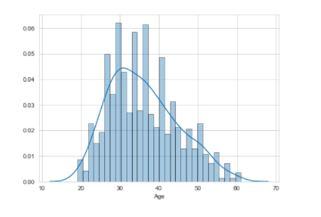

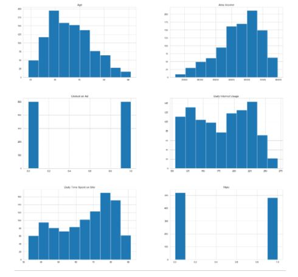

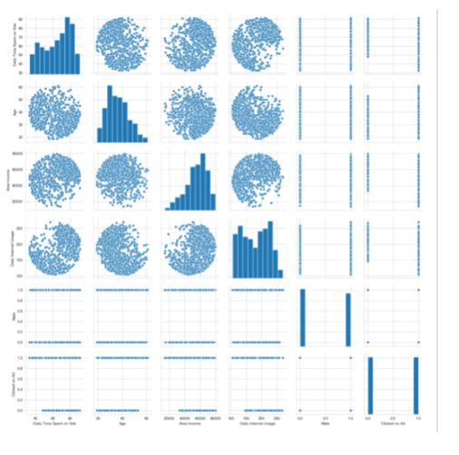

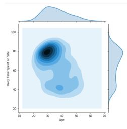

This shows that the younger adults (in the age of 20-40) have spent the most time on the website. However, we should also consider that they have the most population compared to other age groups in the dataset.

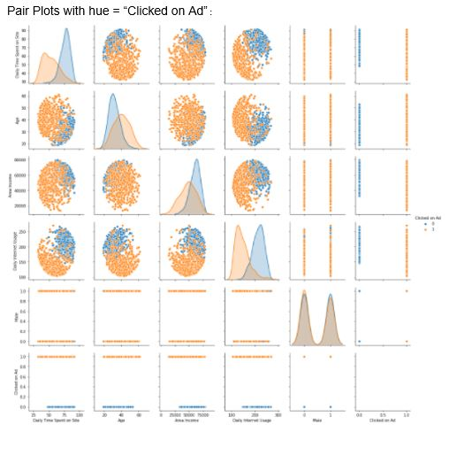

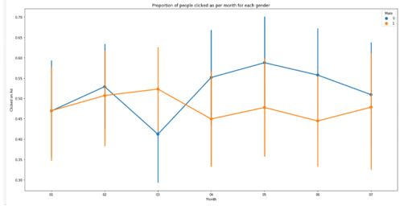

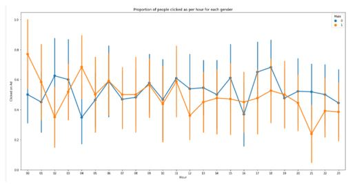

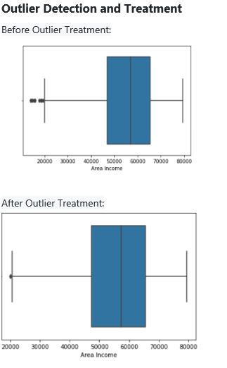

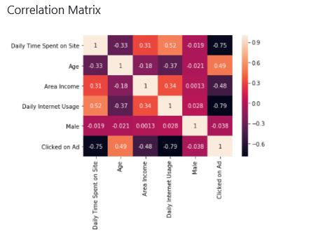

## Feature Engineering

We have some non-numerical values that we have to manage before using them as inputs of our machine learning algorithm, such as 'Ad Topic Line', 'City', 'Country', 'Timestamp'.
Considering the 'Ad Topic Line' we decide to drop it for now. However, it should be considered that using Natural Language Processing we might get interesting information out of it, if more details about the dataset are provided.

Regarding the 'City' and the 'Country', we can replace them by dummy variables with numerical values, however, in this way we get too many new features.
Another approach would be considering them as categorical values and coding them in one numeric feature.

The 'Timestamp' conversion into numerical values is a bit more complicated. We can consider converting timestampts directly to numbers, or converting them to slots of time/day and see it as a categorical value and then convert it to numerical.

Here we have chosen to take the month and the hour from the timestamp as numerical features.

## Model Training and Evaluation:

The ML models trained were:  
1. Logistic Regression  
2. Random Forest Classifier  

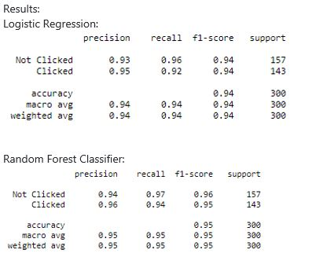

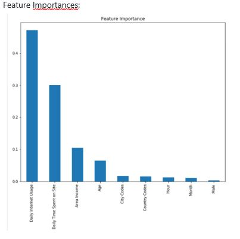

